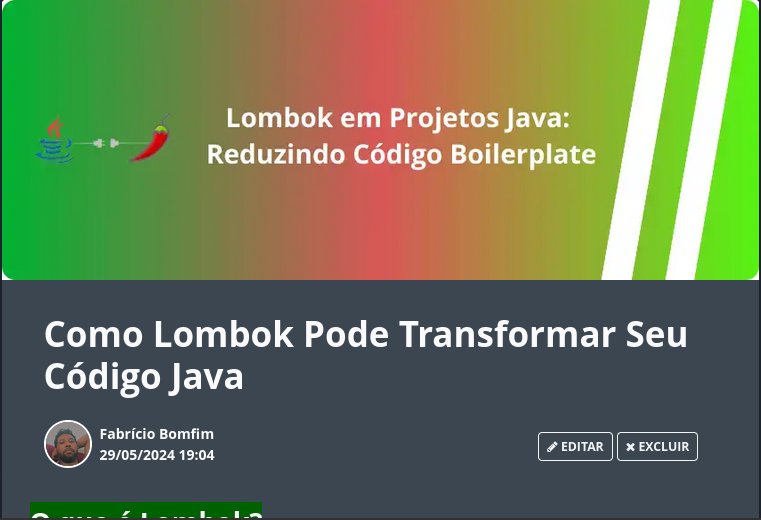

  

-------

# Projeto artigo técnico gerado por I.A.s

 > ℹ️ **NOTE:** Este é o repositório desenvolvido durante o bootcamp no qual participei na plataforma da [DIO](https://dio.me).

Projeto com o objetivo de gerar um artigo técnico com um layout rico, leitura agradável e com foco em promover autoridade técnica.

<a href="https://web.dio.me/articles/como-lombok-pode-transformar-seu-codigo-java?back=%2Farticles&open-modal=true&page=1&order=oldest" title="View PDF now"> 📕Clique aqui para ler o artigo</a>

## 💻 Tecnologias utilizadas no projeto

- [ChatGPT](https://chat.openai.com/) - para título e conteúdo
- [Canva](https://https://www.canva.com/pt_br/) - Para formatação de banners e Layouts

## 📄 Prompts e ferramentas

ChatGPT：

|   Ação   | prompt                                                                                                                                                                                                                                                                         |
| :------: | ------------------------------------------------------------------------------------------------------------------------------------------------------------------------------------------------------------------------------------------------------------------------------ |
|  título  | Crie 5 variações de títulos sobe lombok para o artigo                                                                                                                                                                                                    |
| conteúdo | comporte-se como um escritor de artigos tech e escreva
um artigo sobre o uso do LOMBOK em projetos JAVA atendendo as regras:{REGRAS}-aplicar exemplos de uso e trechos de código-criar tópicos curtos de no máximo 5 linhas-criar subtitulos nos tópicos |

## ✨ Features

- Conteúdo gerado via ChatGPT
- Capa criada no canva.com.br

## 📚 Materiais

- prompts utilizados

## 🛠️ Instruções de execução

Utilize os prompts acima nas ferramentas sugeridas para gerar o material base e utilize uma ferramenta de edição de documentos como power point, libreoffice , indesign para diagramação, o passo a passo em vídeo pode ser conferido na plataforma da [DIO](https://dio.me).

## 👨‍💻 Expert

    
&nbsp&nbsp&nbspFabricio Vieira 
    &nbsp&nbsp&nbsp
    <a href="https://github.com/vieira-fabricio">
    GitHub</a>&nbsp;|&nbsp;
    <a href="www.linkedin.com/in/
vieira-fabricio/">LinkedIn</a>
&nbsp;|&nbsp;
    <a href="https://www.instagram.com/diar.iodev/">
    Instagram</a>
&nbsp;|&nbsp;

  

---

por [Fabricio Vieira](https://github.com/vieira-fabricio)
